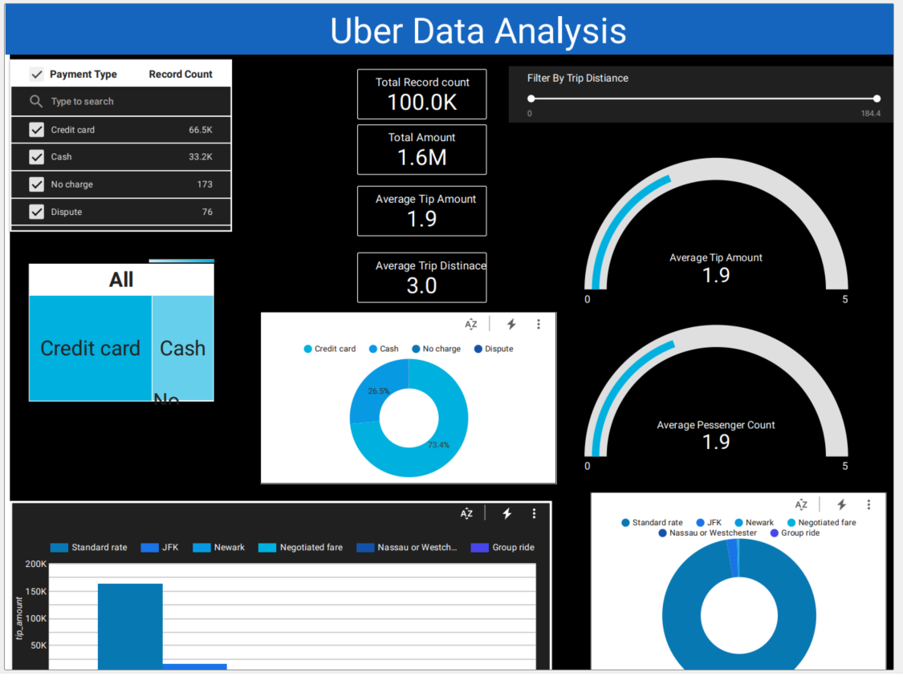
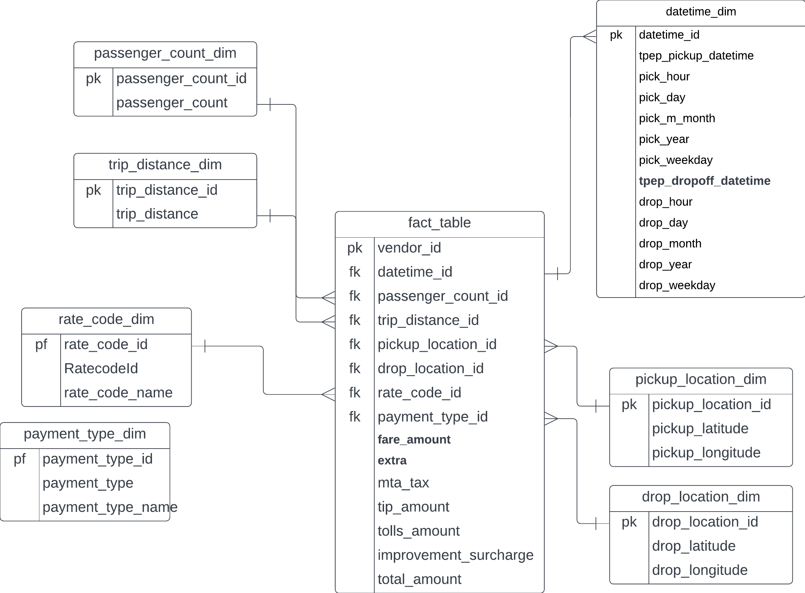

# Uber Data Analytics | End-To-End Data Engineering Project
This repository contains the code and documentation for an end-to-end data engineering project focused on Uber data analytics. The project builds a data pipeline using various technologies and platforms, including Python, Google Cloud Platform (GCP), Google Storage, Compute Instance, BigQuery, Looker Studio, and the modern data pipeline tool Mage.ai.

## Introduction
The goal of this project is to develop a comprehensive data engineering solution for Uber data analytics. By leveraging data from various sources, transforming it, and storing it in a scalable data warehouse, the project enables advanced analytics and data visualization using Looker Studio.

## Architecture
The architecture of the Uber Data Analytics project consists of several key components:

## Technology Used
The following technologies and platforms are utilized in this project:

* **Programming Language** - Python: Python is used as the primary programming language for implementing the data engineering pipeline and performing data transformations.
Google Cloud Platform (GCP): GCP provides a suite of cloud services that are leveraged in this project.
* **Google Storage**: Google Storage is used to store the input data files that are processed by the pipeline.
* **Compute Instance**: A compute instance is provisioned on GCP to execute the data engineering pipeline code.
* **BigQuery**: BigQuery is used as the target data storage system, providing a scalable and fully-managed data warehouse solution.
* **Looker Studio**: Looker Studio is a data visualization and exploration platform used to create interactive dashboards and visualizations based on the transformed data.
Final Analysis Reports:

* **Modern Data Pipeline Tool - Mage.ai**: Mage.ai is a modern data pipeline tool that simplifies the development, deployment, and orchestration of data pipelines. It is used in this project to streamline the data engineering workflow.

## Data Model
The data model for the Uber Data Analytics project is given in the image below:

